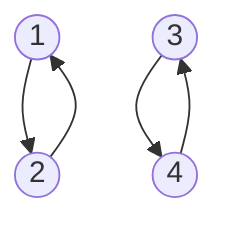
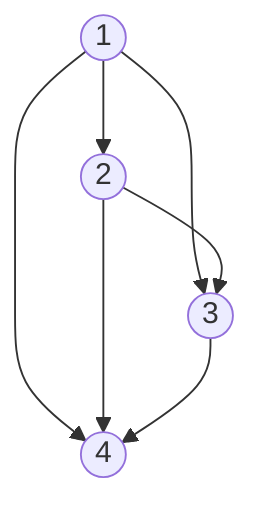
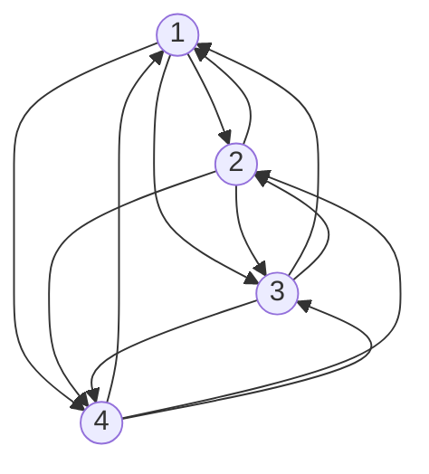

# Ejercicio 1

## Consigna

Determine si las siguientes relaciones son reflexivas, simétricas, antisimétricas, asimétricas $((x, y) \in R \Rightarrow (y, x) \notin R)$ o transitivas en $A = \{1, 2, 3, 4\}$:

(a) $R = \{(1, 1), (1, 2), (2, 1), (2, 2), (3, 3), (3, 4), (4, 3), (4, 4)\}$.
(b) $R = \{(1, 2), (1, 3), (1, 4), (2, 3), (2, 4), (3, 4)\}$.
(c) $R = \{(1, 3), (1, 1), (3, 1), (1, 2), (3, 3), (4, 4)\}$.
(d) $R = \emptyset$.
(e) $R = A \times A$.

## Resolución (parte a)

La relación $R = \{(1, 1), (1, 2), (2, 1), (2, 2), (3, 3), (3, 4), (4, 3), (4, 4)\}$ es reflexiva, simétrica y transitiva.

- Reflexiva: $(1, 1), (2, 2), (3, 3), (4, 4) \in R$.
- Simétrica: $(1, 2) \in R \Rightarrow (2, 1) \in R$, $(3, 4) \in R \Rightarrow (4, 3) \in R$.
- Antisimétrica: No se cumple porque $(1, 2) \in R$ y $(2, 1) \in R$.
- Asimétrica: No se cumple porque $(1, 2) \in R$ y $(2, 1) \in R$.
- Transitiva: Viendo el gráfico se observa que la relación es transitiva.

**Observación**: No se dibujan los lazos porque no aportan información adicional.

## Resolución (parte b)

La relación $R = \{(1, 2), (1, 3), (1, 4), (2, 3), (2, 4), (3, 4)\}$ es asimétrica y transitiva.

**Observación**: No hay lazos.

- NO reflexiva: $(1, 1) \not\in R$.
- NO simétrica: $(1, 2) \in R \Rightarrow (2, 1) \in R$, $(3, 4) \in R \Rightarrow (4, 3) \in R$.
- Antisimétrica: Se cumple ya que no hay elementos $(x, y) \in R$ y $(y, x) \in R$ con $x \neq y$.
- Asimétrica: Se cumple ya que no hay elementos $(x, y) \in R$ y $(y, x) \in R$, y además no hay lazos.
- Transitiva: Viendo el gráfico se observa que la relación es transitiva.

## Resolución (parte e)

La relación $R = A \times A$ es reflexiva, simétrica y transitiva.

- Reflexiva: $(1, 1), (2, 2), (3, 3), (4, 4) \in R$.
- Simétrica: Se ve gráficamente o pensando en que al estar todos los elementos de $A$ relacionados con todos los elementos de $A$, se cumple la simetría.
- NO antisimétrica
- NO asimétrica
- Transitiva: Por el mismo razonamiento de la simetría, podemos ver que es transitiva