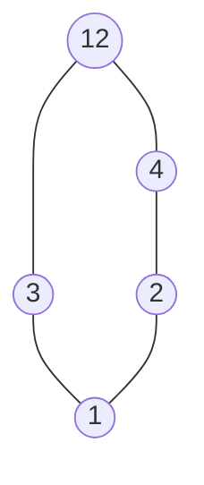
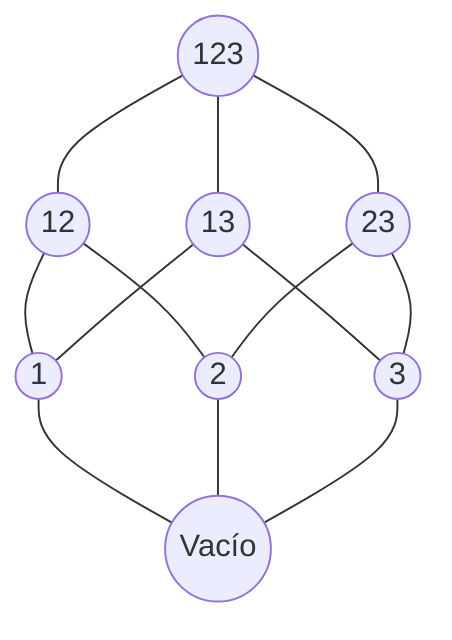

# Ejercicio 1

Para cada uno de los órdenes (A, ≤) siguientes, dibujar el diagrama de Hasse.

(a) $A = \{1, 2, 3, 4, 12\}$ y $\leq$ es el orden de divisibilidad ($x \leq y$ sii $y$ es múltiplo de $x$).
(b) $A$ es el conjunto de todos los subconjuntos de $\{1, 2, 3\}$ y $\leq$ es la inclusión $\subset$.

## Resolución (parte a)

Tener en cuenta para este punto que las flechas no van. Están por un tema del lenguaje que se usa para visualizar los dibujos.

## Resolución (parte b)

Tener en cuenta para este punto que las flechas no van. Están por un tema del lenguaje que se usa para visualizar los dibujos.