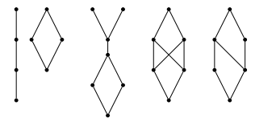

# Ejercicio 10

## Consigna

¿Cuáles de los diagramas de Hasse de la Figura 1 representa un retículo?

## Resolución

Recordemos que un retículo es un conjunto parcialmente ordenado en el que para cada par de elementos $a$ y $b$ existe un supremo y un ínfimo.

- El diagrama 1 es un retículo
- El diagrama 2 es un retículo
- El diagrama 3 no es un retículo, ya que si elijo los elementos 4 y 5 empezando por abajo, no tengo supremo
- El diagrama 4 no es un retículo, ya que si elijo los elementos 2 y 3 empezando por abajo, no tengo supremo
- El diagrama 5 es un retículo