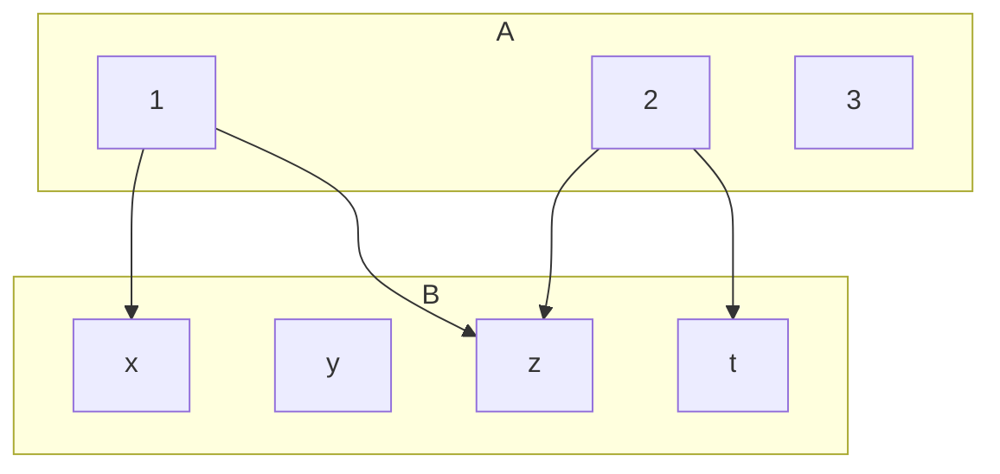
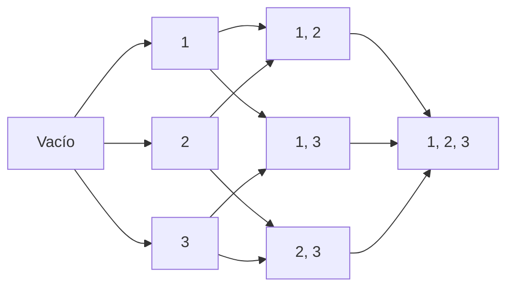

# CLASE 14 - 29/01/2025

## Relaciones

### Definición (producto cartesiano):

El producto cartesiano de dos conjuntos $A$ y $B$ se define como el conjunto de todos los pares ordenados $(a, b)$ donde $a \in A$ y $b \in B$.

$$A \times B = \{(a, b) \mid a \in A, b \in B\}$$

En caso de que $A = B$, se denota $A^2$.

#### Observación

El orden de los elementos en el par ordenado es importante. Es decir, $(a, b) \neq (b, a)$ si $a \neq b$.

### Ejemplo

Sean $A = \{1, 2\}$ y $B = \{3, 4\}$. Entonces, 
- $A \times B = \{(1, 3), (1, 4), (2, 3), (2, 4)\}$.
- $B \times A = \{(3, 1), (3, 2), (4, 1), (4, 2)\}$.

De este ejemplo vemos que en general, el producto cartesiano NO es commutativo: $A \times B \neq B \times A$.

### Proposición

Sean $A$, $B$ y $C$ conjuntos finitos. Entonces, $A \times B$ también es finito y:

$$|A \times B| = |A| \cdot |B|$$

Donde $|A|$ denota la cantidad de elementos de $A$ o el cardinal de $A$.

### Definición (relación)

Dados dos conjuntos $A$ y $B$, llamamos:
- una relación de $A$ en $B$ a todo subconjunto $R \subset (A \times B)$.

- una relación binaria en $A$ a todo subconjunto $R \subset A^2$.

Dados $R\subset A\times B, x\in A, y\in B$, se escriben:

- $xRy$ si $(x, y) \in R$.
- $x \cancel{R} y$ si $(x, y) \not\in R$.

### Ejemplo 1

Sea $A = \{1, 2, 3\}, B = \{x, y, z, t\}$, definimos $R$:

$$R=\{(1, x), (1, z), (2, z), (2, t)\}$$

Entonces, $R$ es una relación de $A$ en $B$. Llamamos a este tipo de definición, definición por extensión.

### Ejemplo 2

Sea $A=B=P(\{1, 2, 3\})$, que es el conjunto potencia de $\{1, 2, 3\}$, o sea todos los subconjuntos de dicho conjunto. Definimos $R$:

$$R=\{(X, Y) \in P(\{1, 2, 3\})^2 \mid X \subset Y\}$$

Algunos elementos que están relacionados podrían ser:

- $\{1, 2\} R \{1, 2, 3\}$
- $\{\empty\} R \{2, 3\}$
- $\{1, 2\} R \{1, 2\}$

Llamamos a este tipo de definición, definición por comprensión.

### Ejemplo 3

Sea $A=B=\mathbb{Z}$. Fijamos n $\in \mathbb{Z}^+$ y definimos la congruencia módulo $n$ par:

$xR_ny \iff x-y \text{ es múltiplo de }n$

### Representación de una relación

Dada una relación $R$ de $A$ en $B$, si ambos conjuntos son finitos tenemos que $A\times B$ también es finito. Veamos la representación de del ejemplo 1:

Llamamos a esta representación un diagrama sagital funciona para cuando $A\neq B$.

Para el caso en que $A=B$, podemos representar la relación de la siguiente manera, usando lo que llamamos digrafo:

Este es el ejemplo 2, donde $A=B=P(\{1, 2, 3\})$. Para simplificar en este caso se omiten las relaciones de un elemento en si mismo en el dibujo.

### Definición (relación como función)

Dada una relación $R$ de $A$ en $B$, decimos que $f$ es una función de $A$ en $B$ si para todo $x\in A$ existe un único $y\in B$ tal que $xfy$. En este caso, denotamos $y=f(x)$.

### Propiedades de relaciones (binarias: es decir $A=B$)

Dada una relación $R \subset A^2$, decimos que $R$ es:

- Reflexiva si para todo $x\in A$ se cumple que $xRx$.
- Irreflexiva si para todo $x\in A$ se cumple que $x\cancel{R}x$.
- Simétrica si para todo $x, y\in A$ se cumple que $xRy \Rightarrow yRx$.
- Antisimétrica si para todo $x, y\in A$ se cumple que $xRy \text { y } yRx \Rightarrow x=y$.
- Transitiva si para todo $x, y, z\in A$ se cumple que $xRy \text { y } yRz \Rightarrow xRz$.

### Definición (relación de orden)

Dada una relación $R$ de $A$ en $A$, decimos que $R$ es una relación de orden si es:
- reflexiva
- antisimétrica
- transitiva.

### Definición (relación de equivalencia)

Dada una relación $R$ de $A$ en $A$, decimos que $R$ es una relación de equivalencia si es:
- reflexiva
- simétrica
- transitiva.

### Ejemplo

Sea $A=B={1, 2, 3, 4}$ y definimos $R= \{(1, 1), (2, 2), (3, 4), (4, 3)\}$

- Reflexiva: No es reflexiva, ya que $2\cancel{R}2$.
- Irreflexiva: No es irreflexiva, ya que $1R1$.
- Simétrica: Si es simétrica
- Antisimétrica: No es antisimétrica, ya que $3R4$ y $4R3$, pero $3 \neq 4$.
- Transitiva: No es transitiva, ya que $3R4$ y $4R3$, pero $3\cancel{R}3$.

### Ejemplo

ea $A=B=P(\{1, 2, 3\})$, que es el conjunto potencia de $\{1, 2, 3\}$, o sea todos los subconjuntos de dicho conjunto. Definimos $R$:

$$R=\{(X, Y) \in P(\{1, 2, 3\})^2 \mid X \subset Y\}$$

- Reflexiva: Si es reflexiva.
- Irreflexiva: No es irreflexiva, ya que $\emptyset R \emptyset$.
- Simétrica: No es simétrica, ya que $\emptyset R \{1\}$ pero $\{1\} \cancel{R} \emptyset$.
- Antisimétrica: Si es antisimétrica.
- Transitiva: Si es transitiva.

Entonces es una relación de orden.

### Ejemplo

Sea $A=B=\mathbb{Z}$. Fijamos n $\in \mathbb{Z}^+$ y definimos la congruencia módulo $n$ par:

$xR_ny \iff x-y \text{ es múltiplo de }n$

- Reflexiva: Si es reflexiva.
- Irreflexiva: No.
- Simétrica: Si.
- Antisimétrica: No, porque para cualquier $n$, si $n$ es múltiplo de $k$ entonces $-n$ también lo será (y $n \neq -n$).
- Transitiva: Si.

### Ejemplo

Sea una relación $R$ de $A$ en $A$ que es:

- Reflexiva
- Simétrica
- Antisimétrica
- Transitiva

Qué relación es?

La respuesta es la relación de igualdad sobre $A$. Veamos por qué:

Si $x=y$, entonces $xRy$ por reflexividad. Pero si $xRy$, entonces $yRx$ por simetría. Si $xRy$ y $yRx$, entonces $x=y$ por antisimetría.

Entonces la relación es la igualdad, que es la única relación que es a la vez una relación de orden y una relación de equivalencia.