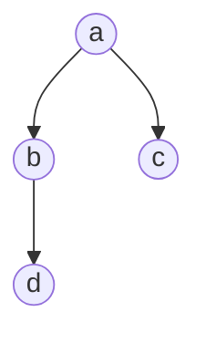
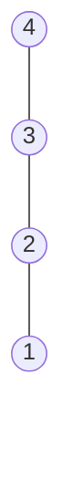
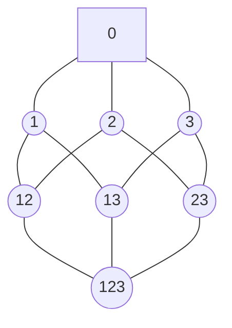
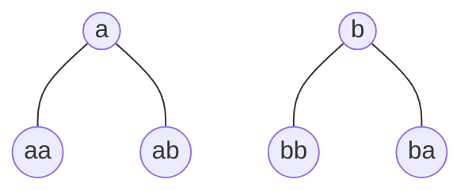

# CLASE 16 - 30/01/2025

**Observación**: Si $\leq$ es un orden sobre $A$, entonces la relación $x < y \iff x \leq y\text{ y } x\neq y$ es un orden escricto (es decir, irreflexiva y transitiva).

**Observación**: Si $<$ es un orden estricto sobre $A$, entonces la relación $x \leq y \iff x < y\text{ o } x = y$ es un orden parcial sobre $A$.

## Diagrama de Hasse

### Ejemplo

Sea $A = \{a,b,c,d\}$ y la relación $\leq$ definida por:

$$\leq := \{(a,a), (b,b), (c,c), (d,d), (a,b), (a,c), (b,d), (a,d)\}$$

### Definición (diagrama de Hasse)

Sea un orden $\leq$ sobre un conjunto finito $A$ (y $<$ el orden estricto asociado). El **diagrama de Hasse** de $(A, \leq)$ es el digrafo $(V,E)$ que cumple:

- $V = A$
- $E = \{(x,y) \in A^2 : x < y \text{ y } \cancel{\exists} z\in A, x < z \text{ y } z < y \}$

### Ejemplos

1. Sea $A = \{1,2,3,4\}$ y la relación $\leq$ menor o igual:

2. Sea $A = P({1, 2, 3})$ y $\subset$ el orden de subconjunto:

3. $A = $ Palabras sobre $\{a,b\}$ y $\leq$ es el orden de prefijo:

Esto se conoce como un árbol

## Elementos minimales y maximales

### Definición

Dado $\leq$ un órden sobre $A$. Se llama:

- Elemento minimal a todo elemento $x\in A$ tal que $\forall y\in A, y \leq x \Rightarrow y = x$. Es decir, $x$ no tiene predecesores.

- Elemento maximal a todo elemento $x\in A$ tal que $\forall y\in A, y \geq x \Rightarrow y = x$. Es decir, $x$ no tiene sucesores.

### Proposición

Todo conjunto ordenado, finito y no vacío tiene al menos un elemento minimal y un elemento maximal.

### Aplicación (orden topológico)

Sea $A$ un conjunto de $n$ tareas, ordenador por:

$$\leq := \{(x,y) : x \text{ debe hacerse antes que } y\}$$

A partir de esto, queremos hallar un orden lineal $a_1, a_2, \ldots, a_n$ tal que $a_i$ debe hacerse antes que $a_j$ si $i \leq j$.

Hagámoslo con el siguiente algorítmo:

- $l: \text{lista ordenada} \subset A$
- $B: \text{su complemento}$

$l:= \emptyset$, $B:= A$
mientras $B \neq \emptyset$ hacer:
- tomar $x \in B$ minimal en $B$
- agregar $x$ a $l$
- eliminar $x$ de $B$

fin mientras

devolver $l$

## Mínimos y máximos

### Definición

Sea ($A, \leq$) un conjunto ordenado. Se dice que un elemento $x\in A$ es:

- Mínimo si $\forall y\in A, x \leq y$
- Máximo si $\forall y\in A, y \leq x$

### Proposición

El mínimo (o máximo) de un conjunto ordenado, si existe, es único.

### Ejemplos

1. Sea ($\mathbb{N}, \leq$) el conjunto de los enteros con el orden usual. 
    - Tiene mínimo pero no máximo

2. Sea ($\mathbb{Z}, \leq$) el conjunto de los enteros con el orden usual. 
    - No tiene ni mínimo ni máximo

3. Sea $(P(U), \subset)$ el conjunto de los subconjuntos de un conjunto $U$ con el orden de inclusión.
    - Tiene mínimo ($\emptyset$) y máximo ($U$)