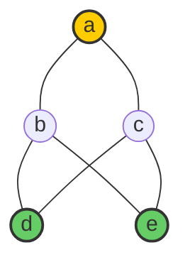

# CLASE 17 - 30/01/2025

## Cotas inferiores y superiores

### Definición (cota)

Sea $(A, \leq)$ un conjunto ordenado. Dado un subconjunto $B \subset A$ se llama:

- Cota inferior de $B$ a todo $a \in A$ tal que $a \leq b$ para todo $b \in B$.
- Cota superior de $B$ a todo $a \in A$ tal que $a \geq b$ para todo $b \in B$.

Observación: Las cotas inferiores no son únicas en general. Pero si una cota inferior (o superior) pertenece a $B$ entonces es el mínimo (o máximo) de $B$.

### Ejemplo

Sea $A = \{a,b,c,d,e\}$ y la relación $\leq$ definida por el siguiente diagrama de Hasse

Entonces si tomamos $B = \{b,c\}$, las cotas superiores de $B$ son $a$ y las cotas inferiores son $d$ y $e$.

## Mínimos y máximos

### Definición (mínimo y máximo)

Sea $(A, \leq)$ un conjunto ordenado. Dado un subconjunto $B \subset A$:

- Cuando el conjunto de las cotas inferiores de $B$ tiene un máximo, se llama el ínfimo de B y se escribe $\inf B$. Si $\inf B \in B$ se llama el mínimo de $B$.

- Cuando el conjunto de las cotas superiores de $B$ tiene un mínimo, se llama el supremo de B y se escribe $\sup B$. Si $\sup B \in B$ se llama el máximo de $B$.

**Observación**: En el ejemplo anterior podemos ver que $\inf B = a$ y no existe supremo.

**Observación**: Cuando existen, ínfimo y supremo son únicos.

### Definición (retículo)

Un conjunto ordenado $(A, \leq)$ es un **retículo** si para todo $a,b \in A$ existen $\inf \{a,b\}$ y $\sup \{a,b\}$.

### Ejemplos

1. $(\mathbb{N}, \leq)$ es un retículo: $\inf \{a,b\} = \min\{a,b\}$ y $\sup \{a,b\} = \max\{a,b\}$.

2. $(P(U), \subset)$ es un retículo: $\inf \{A,B\} = A \cap B$ y $\sup \{A,B\} = A \cup B$.

### Proposición

Todo retículo finito y no vacío tiene mínimo y máximo.

#### Demostración

Sea $(A, \leq)$ un retículo finito y no vacío. Como es finito y no vacío tiene un elemento minimal $x$ (proposición de la clase anterior). Es decir:

$$\forall y \in A, y \leq x \Rightarrow y = x$$

Sea $y \in A$, como $A$ es un retículo, existe $\inf \{x,y\}$. Por definición de ínfimo, $\inf \{x,y\} \leq x$. Pero como $x$ es minimal, $\inf \{x,y\} = x$. Por lo tanto, $x \leq y$.

## Relaciones de equivalencia

### Definición

Una relación $\sim$ en un conjunto $A$ es una **relación de equivalencia** si cumple las siguientes propiedades:

- Reflexiva: $\forall a \in A, a \sim a$.
- Simétrica: $\forall a,b \in A, a \sim b \Rightarrow b \sim a$.
- Transitiva: $\forall a,b,c \in A, a \sim b \land b \sim c \Rightarrow a \sim c$.

### Ejemplos

1. Sea $A = \mathbb{Z}$ y la relación $R \subset \mathbb{Z}^2$ definida por $a R b \Leftrightarrow a - b \text{ es par}$
    - Reflexiva: $a - a = 0$ es par.
    - Simétrica: $a - b$ es par $\Rightarrow b - a$ es par.
    - Transitiva: $a - b$ y $b - c$ son pares $\Rightarrow a - c$ es par.

2. Sea $A = \mathbb{Z}$ y la relación $R \subset \mathbb{Z}^2$ definida por $a R b \Leftrightarrow a - b \text{ es divisible por } p$

3. Sea $A = \mathbb{Z}$ y la relación $R \subset \mathbb{Z}^2$ definida por $a R b \Leftrightarrow a^2 = b^2$

### Definición (clase de equivalencia)

Dada una relación de equivalencia $\sim$ en un conjunto $A$, la **clase de equivalencia** de un elemento $a \in A$ es el conjunto:

$$[a] = \{b \in A : a \sim b\}$$

### Ejemplos

1. En el ejemplo 1, la clase de equivalencia de $a$ es $[a] = \{a, a+2, a-2, \ldots\}$. En general, las clases de equivalencia son los conjuntos de números pares e impares. En este caso tenemos dos clases de equivalencia.

2. En el ejemplo 2, dado $p \geq 1$, la clase de equivalencia de $a$ es $[a] = \{a, a+p, a+2p, \ldots\} = \{x + kp \mid k\in \mathbb{Z} \}$. En este caso tenemos $p$ clases de equivalencia.

3. En el ejemplo 3, la clase de equivalencia de $a$ es $[a] = \{a, -a\}$. En este caso tenemos infinitas clases de equivalencia, porque tenemos tantas clases como elementos en $A = \mathbb{Z}$.

### Proposición

Para todos $x,y \in A$, se cumplen:

1. $x \in [x]$
2. $xRy \iff [x] = [y]$
3. $xRy \iff [x] \cap [y] \neq \emptyset$
4. $x\cancel{R}y \iff [x] \cap [y] = \emptyset$

## Particiones

### Definición

Una partición de un conjunto $A$ es un conjunto $P\subset P(A)$ tal que:

1. $\emptyset \notin P$
2. $\forall X,Y \in P, X\neq Y \Rightarrow X \cap Y = \emptyset$
3. $\bigcup_{X\in P} X = A$ (es decir: $\forall x\in A, \exists X\in P, x\in X$)

**Idea**: Una partición es una forma de dividir un conjunto en subconjuntos disjuntos que nunca son vacíos.